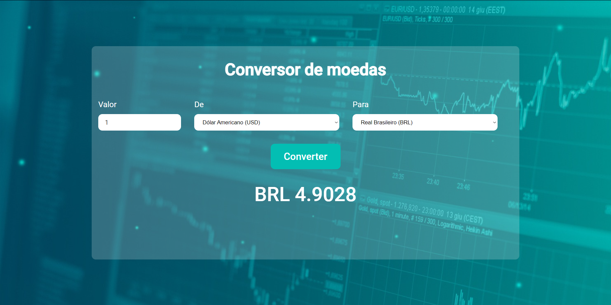

# Currency converter &#128184;

Currency converter that uses the [AwesomeAPI](<https://docs.awesomeapi.com.br/api-de-moedas>) to get current data of currencies.

## How it was done &#9881;
- React  
- Vite   
- styled-components   
- React states  

